# Diagram przepływu autentykacji - Go Girl Workout App

<authentication_analysis>

## Analiza przepływów autentykacji

### 1. Przepływy autentykacji wymienione w dokumentacji

Na podstawie analizy PRD i auth-spec.md, zidentyfikowano następujące przepływy:

1. **Logowanie (Login)**
   - Użytkownik wprowadza email i hasło
   - Walidacja po stronie klienta (Zod)
   - Wywołanie Supabase Auth API
   - Przekierowanie do strony głównej po sukcesie

2. **Rejestracja (Register)**
   - Użytkownik wprowadza email, hasło i potwierdzenie hasła
   - Walidacja po stronie klienta
   - Wywołanie Supabase Auth API
   - Automatyczne logowanie (jeśli autoconfirm) lub wymagane potwierdzenie emaila
   - Przekierowanie do strony głównej lub logowania

3. **Reset hasła (Reset Password)**
   - Część 1: Użytkownik wprowadza email
   - Wysłanie linku resetującego przez Supabase
   - Część 2: Użytkownik klika link w emailu
   - Weryfikacja tokenu
   - Ustawienie nowego hasła
   - Przekierowanie do logowania

4. **Potwierdzenie emaila (Email Confirmation)**
   - Użytkownik klika link w emailu
   - Callback weryfikuje token
   - Przekierowanie do logowania

5. **Wylogowanie (Sign Out)**
   - Użytkownik klika przycisk wylogowania
   - Wywołanie Supabase Auth API
   - Usunięcie sesji
   - Przekierowanie do logowania

6. **Odświeżenie sesji (Session Refresh)**
   - Middleware odświeża sesję przy każdym żądaniu
   - Automatyczne odświeżenie tokenu jeśli wygasł
   - Weryfikacja autoryzacji w Server Components

7. **Ochrona tras (Route Protection)**
   - Middleware odświeża sesję
   - Server Components weryfikują autoryzację przez getUserId()
   - Przekierowanie do logowania przy braku sesji

### 2. Główni aktorzy i ich interakcje

**Aktorzy:**

1. **Przeglądarka (Browser)** - Client Component, formularze, nawigacja
2. **Middleware** - Odświeżanie sesji przed renderowaniem
3. **Server Components** - Weryfikacja autoryzacji, renderowanie stron
4. **AuthProvider** - Synchronizacja stanu autentykacji między Server a Client Components
5. **authStore (Zustand)** - Globalny store stanu autentykacji w Client Components
6. **Supabase Auth** - Serwis autentykacji, zarządzanie sesjami

**Interakcje:**

- Przeglądarka ↔ Middleware: Odświeżanie sesji przy każdym żądaniu
- Przeglądarka ↔ Server Components: Renderowanie stron z weryfikacją autoryzacji
- Przeglądarka ↔ Supabase Auth: Logowanie, rejestracja, reset hasła, wylogowanie
- Middleware ↔ Supabase Auth: Odświeżanie tokenów
- Server Components ↔ Supabase Auth: Weryfikacja sesji, pobieranie użytkownika
- Server Components ↔ AuthProvider: Przekazywanie danych użytkownika do Client Components
- AuthProvider ↔ authStore: Inicjalizacja i aktualizacja store z danymi użytkownika
- AuthProvider ↔ Supabase Auth: Subskrypcja zmian stanu autentykacji (onAuthStateChange)

### 3. Procesy weryfikacji i odświeżania tokenów

**Weryfikacja tokenu:**

- Middleware wywołuje `supabase.auth.getUser()` przy każdym żądaniu
- Automatyczne odświeżenie jeśli token wygasł (jeśli refresh_token ważny)
- Server Components używają `requireAuth()` do weryfikacji autoryzacji (automatyczne przekierowanie do /login)
- Alternatywnie `getUserId()` z fallbackiem do DEFAULT_USER_ID (development)
- Jeśli brak sesji → przekierowanie do logowania przez `requireAuth()`

**Odświeżanie tokenu:**

- Middleware automatycznie odświeża sesję przez `getUser()`
- `@supabase/ssr` zarządza refresh_token automatycznie
- Cookies synchronizowane między server a client

### 4. Opis kroków autentykacji

**Logowanie:**

1. Użytkownik wprowadza dane w formularzu
2. Walidacja po stronie klienta (Zod)
3. Wywołanie `supabase.auth.signInWithPassword()`
4. Supabase weryfikuje dane i zwraca sesję
5. Tokens zapisywane w cookies przez `@supabase/ssr`
6. Aktualizacja `authStore` przez `setUser()` w `useLoginForm`
7. `AuthProvider` subskrybuje zmiany przez `onAuthStateChange` i aktualizuje store
8. Przekierowanie do strony głównej

**Rejestracja:**

1. Użytkownik wprowadza dane w formularzu
2. Walidacja po stronie klienta
3. Wywołanie `supabase.auth.signUp()`
4. Supabase tworzy konto i wysyła email (jeśli wymagane)
5. Automatyczne logowanie lub wymagane potwierdzenie
6. Przekierowanie do odpowiedniej strony

**Reset hasła:**

1. Użytkownik wprowadza email
2. Wywołanie `supabase.auth.resetPasswordForEmail()`
3. Supabase wysyła link resetujący
4. Użytkownik klika link → przekierowanie do `/reset-password/confirm`
5. Weryfikacja tokenu
6. Użytkownik wprowadza nowe hasło
7. Wywołanie `supabase.auth.updateUser()`
8. Przekierowanie do logowania

**Odświeżenie strony:**

1. Middleware przechwytuje żądanie
2. Wywołanie `supabase.auth.getUser()` → odświeżenie sesji
3. Server Component (AppLayout) pobiera użytkownika przez `createClient()`
4. AppLayout renderuje `AuthProvider` z danymi użytkownika
5. AuthProvider inicjalizuje `authStore` i subskrybuje zmiany autentykacji
6. Chronione strony używają `requireAuth()` do weryfikacji autoryzacji
7. Jeśli sesja ważna → renderowanie strony
8. Jeśli sesja wygasła → automatyczne przekierowanie do /login przez `requireAuth()`

</authentication_analysis>

## Diagram przepływu autentykacji

```mermaid
sequenceDiagram
    autonumber
    participant Browser as Przeglądarka
    participant Middleware as Middleware
    participant ServerComp as Server Component
    participant AuthProvider as AuthProvider
    participant AuthStore as authStore
    participant SupabaseAuth as Supabase Auth

    Note over Browser,SupabaseAuth: Przepływ logowania

    Browser->>Browser: Użytkownik wprowadza email i hasło
    Browser->>Browser: Walidacja formularza (Zod)

    alt Błędy walidacji
        Browser->>Browser: Wyświetlenie błędów
    else Walidacja OK
        Browser->>SupabaseAuth: signInWithPassword(email, password)
        activate SupabaseAuth

        alt Błąd autoryzacji
            SupabaseAuth-->>Browser: Błąd (nieprawidłowe dane)
            Browser->>Browser: Wyświetlenie komunikatu błędu
        else Sukces
            SupabaseAuth-->>Browser: Sesja z access_token i refresh_token
            SupabaseAuth->>Browser: Zapisanie tokens w cookies
            Browser->>AuthStore: setUser(data.user)
            activate AuthStore
            AuthStore-->>Browser: Store zaktualizowany
            deactivate AuthStore
            Browser->>Browser: Przekierowanie do strony głównej
        end

        deactivate SupabaseAuth
    end

    Note over Browser,SupabaseAuth: Przepływ rejestracji

    Browser->>Browser: Użytkownik wprowadza dane rejestracji
    Browser->>Browser: Walidacja formularza (Zod)

    alt Błędy walidacji
        Browser->>Browser: Wyświetlenie błędów
    else Walidacja OK
        Browser->>SupabaseAuth: signUp(email, password)
        activate SupabaseAuth

        alt Błąd rejestracji
            SupabaseAuth-->>Browser: Błąd (konto istnieje, itp.)
            Browser->>Browser: Wyświetlenie komunikatu błędu
        else Sukces
            SupabaseAuth-->>Browser: Dane użytkownika

            alt Autoconfirm włączone
                SupabaseAuth-->>Browser: Sesja (automatyczne logowanie)
                Browser->>Browser: Przekierowanie do strony głównej
            else Wymagane potwierdzenie emaila
                SupabaseAuth->>Browser: Email z linkiem aktywacyjnym
                Browser->>Browser: Przekierowanie do logowania
                Note over Browser: Użytkownik klika link w emailu
                Browser->>ServerComp: GET /auth/callback?token=...
                ServerComp->>SupabaseAuth: Weryfikacja tokenu
                SupabaseAuth-->>ServerComp: Potwierdzenie
                ServerComp->>Browser: Przekierowanie do /login
            end
        end

        deactivate SupabaseAuth
    end

    Note over Browser,SupabaseAuth: Przepływ resetu hasła

    Browser->>Browser: Użytkownik wprowadza email
    Browser->>SupabaseAuth: resetPasswordForEmail(email)
    activate SupabaseAuth
    SupabaseAuth->>Browser: Email z linkiem resetującym
    SupabaseAuth-->>Browser: Sukces (zawsze pozytywny komunikat)
    deactivate SupabaseAuth

    Note over Browser: Użytkownik klika link w emailu
    Browser->>ServerComp: GET /reset-password/confirm?token=...
    ServerComp->>SupabaseAuth: Weryfikacja tokenu
    activate SupabaseAuth

    alt Token nieprawidłowy
        SupabaseAuth-->>ServerComp: Błąd weryfikacji
        ServerComp->>Browser: Przekierowanie do /reset-password
    else Token prawidłowy
        SupabaseAuth-->>ServerComp: Potwierdzenie tokenu
        ServerComp->>Browser: Wyświetlenie formularza nowego hasła
        Browser->>Browser: Użytkownik wprowadza nowe hasło
        Browser->>SupabaseAuth: updateUser({ password: newPassword })

        alt Błąd zmiany hasła
            SupabaseAuth-->>Browser: Błąd
            Browser->>Browser: Wyświetlenie komunikatu błędu
        else Sukces
            SupabaseAuth-->>Browser: Hasło zmienione
            Browser->>Browser: Przekierowanie do /login
        end
    end

    deactivate SupabaseAuth

    Note over Browser,SupabaseAuth: Przepływ wylogowania

    Browser->>Browser: Użytkownik klika "Wyloguj"
    Browser->>SupabaseAuth: signOut()
    activate SupabaseAuth
    SupabaseAuth->>Browser: Usunięcie tokens z cookies
    SupabaseAuth-->>Browser: Sukces
    deactivate SupabaseAuth
    SupabaseAuth->>AuthProvider: onAuthStateChange("SIGNED_OUT")
    activate AuthProvider
    AuthProvider->>AuthStore: clearUser()
    activate AuthStore
    AuthStore-->>AuthProvider: Store wyczyszczony
    deactivate AuthStore
    deactivate AuthProvider
    Browser->>Browser: Przekierowanie do /login

    Note over Browser,SupabaseAuth: Przepływ odświeżenia strony i sesji

    Browser->>Middleware: Żądanie HTTP (każde żądanie)
    activate Middleware
    Middleware->>SupabaseAuth: getUser() - odświeżenie sesji
    activate SupabaseAuth

    alt Sesja ważna
        SupabaseAuth-->>Middleware: Użytkownik i sesja
        Middleware->>Browser: Kontynuacja żądania
    else Sesja wygasła ale refresh_token ważny
        SupabaseAuth->>SupabaseAuth: Automatyczne odświeżenie tokenu
        SupabaseAuth-->>Middleware: Nowa sesja
        Middleware->>Browser: Kontynuacja żądania
    else Sesja i refresh_token wygasły
        SupabaseAuth-->>Middleware: Brak sesji
        Middleware->>Browser: Kontynuacja żądania (bez blokowania)
    end

    deactivate SupabaseAuth
    deactivate Middleware

    Browser->>ServerComp: Renderowanie strony (AppLayout)
    activate ServerComp
    ServerComp->>SupabaseAuth: getUser() przez createClient()
    activate SupabaseAuth
    SupabaseAuth-->>ServerComp: user (lub null)
    deactivate SupabaseAuth

    ServerComp->>AuthProvider: Renderowanie z user prop
    activate AuthProvider
    AuthProvider->>AuthStore: setUser(user) - inicjalizacja
    activate AuthStore
    AuthStore-->>AuthProvider: Store zaktualizowany
    deactivate AuthStore
    AuthProvider->>SupabaseAuth: onAuthStateChange subscription
    activate SupabaseAuth
    SupabaseAuth-->>AuthProvider: Subskrypcja aktywna
    deactivate SupabaseAuth
    AuthProvider-->>ServerComp: AuthProvider gotowy
    deactivate AuthProvider

    ServerComp->>ServerComp: Renderowanie chronionej strony
    ServerComp->>SupabaseAuth: requireAuth() - weryfikacja
    activate SupabaseAuth

    alt Użytkownik zalogowany
        SupabaseAuth-->>ServerComp: user.id
        ServerComp->>ServerComp: Renderowanie chronionej strony
        ServerComp->>Browser: HTML strony z AuthProvider
    else Użytkownik niezalogowany
        SupabaseAuth-->>ServerComp: Brak użytkownika
        ServerComp->>Browser: redirect("/login?error=session_expired")
    end

    deactivate SupabaseAuth
    deactivate ServerComp

```

