# Diagram podróży użytkownika - Moduł autentykacji

<user_journey_analysis>

## 1. Wszystkie ścieżki użytkownika z dokumentacji

### Ścieżki publiczne (niezalogowani):

1. **Strona główna (`/`)** - dostępna dla wszystkich, możliwość przejścia do logowania
2. **Logowanie (`/login`)** - formularz email/password z checkboxem "Zapamiętaj mnie"
3. **Rejestracja (`/register`)** - formularz email/password/confirmPassword
4. **Reset hasła (`/reset-password`)** - formularz wysłania linku resetującego
5. **Potwierdzenie resetu hasła (`/reset-password/confirm`)** - formularz ustawienia nowego hasła po kliknięciu linku w emailu
6. **Callback Supabase (`/auth/callback`)** - obsługa potwierdzenia emaila i resetu hasła

### Ścieżki chronione (wymagają autoryzacji):

7. **Ćwiczenia (`/(app)/exercises`)** - zarządzanie ćwiczeniami
8. **Plany treningowe (`/(app)/workout-plans`)** - zarządzanie planami
9. **Sesje treningowe (`/(app)/workout-sessions`)** - sesje treningowe
10. **Rekordy osobiste (`/(app)/personal-records`)** - przeglądanie rekordów

### Akcje użytkownika:

11. **Wylogowanie** - przez przycisk w nawigacji
12. **Odświeżenie strony** - zachowanie sesji lub przekierowanie do logowania

## 2. Główne podróże i odpowiadające im stany

### Podróż 1: Rejestracja nowego użytkownika

- **Stany:**
  - StronaGlowna → FormularzRejestracji → WalidacjaDanych → WyslanieZapytania
  - WyslanieZapytania → PotwierdzenieEmaila (jeśli wymagane) → FormularzLogowania
  - WyslanieZapytania → AutomatyczneLogowanie (jeśli autoconfirm) → StronaGlownaZalogowana

### Podróż 2: Logowanie istniejącego użytkownika

- **Stany:**
  - StronaGlowna → FormularzLogowania → WalidacjaDanych → WeryfikacjaDanych
  - WeryfikacjaDanych → SukcesLogowania → StronaGlownaZalogowana
  - WeryfikacjaDanych → BladLogowania → FormularzLogowania (z błędami)

### Podróż 3: Reset hasła

- **Stany:**
  - FormularzLogowania → FormularzResetuHasla → WyslanieLinku → KomunikatSukcesu
  - KomunikatSukcesu → EmailZLinkiem → KlikniecieLinku → FormularzPotwierdzeniaResetu
  - FormularzPotwierdzeniaResetu → WalidacjaHasla → AktualizacjaHasla → FormularzLogowania

### Podróż 4: Dostęp do chronionych funkcjonalności

- **Stany:**
  - StronaGlownaZalogowana → ProbaDostepuDoFunkcjonalnosci → MiddlewareOdswiezaSesje
  - MiddlewareOdswiezaSesje → AppLayoutPobieraUsera → AuthProviderInicjalizujeStore
  - AuthProviderInicjalizujeStore → WeryfikacjaSesjiPrzezRequireAuth
  - WeryfikacjaSesjiPrzezRequireAuth → SesjaWazna → DostepDoFunkcjonalnosci
  - WeryfikacjaSesjiPrzezRequireAuth → SesjaWygasla → PrzekierowanieDoLogowania

### Podróż 5: Wylogowanie

- **Stany:**
  - StronaGlownaZalogowana → KlikniecieWyloguj → Wylogowanie → FormularzLogowania

## 3. Punkty decyzyjne i alternatywne ścieżki

### Punkt decyzyjny 1: Rejestracja - czy wymagane potwierdzenie emaila?

- **Warunek:** `enable_email_autoconfirm` w konfiguracji Supabase
- **Ścieżka A:** `true` → AutomatyczneLogowanie → StronaGlownaZalogowana
- **Ścieżka B:** `false` → PotwierdzenieEmaila → FormularzLogowania

### Punkt decyzyjny 2: Logowanie - czy zaznaczono "Zapamiętaj mnie"?

- **Warunek:** Wartość checkboxa "Zapamiętaj mnie"
- **Ścieżka A:** `true` → SesjaPrzedluzona → DluzejZalogowany
- **Ścieżka B:** `false` → SesjaStandardowa → StandardowyCzasWaznosci

### Punkt decyzyjny 3: Weryfikacja sesji przy dostępie do chronionych funkcjonalności

- **Warunek:** Czy sesja jest ważna?
- **Ścieżka A:** Sesja ważna → DostepDoFunkcjonalnosci
- **Ścieżka B:** Sesja wygasła → PrzekierowanieDoLogowania

### Punkt decyzyjny 4: Reset hasła - czy token jest ważny?

- **Warunek:** Czy token z emaila jest ważny?
- **Ścieżka A:** Token ważny → FormularzPotwierdzeniaResetu
- **Ścieżka B:** Token nieprawidłowy/wygasły → PrzekierowanieDoResetuHasla

### Punkt decyzyjny 5: Logowanie - czy dane są poprawne?

- **Warunek:** Czy email i hasło są poprawne?
- **Ścieżka A:** Dane poprawne → SukcesLogowania
- **Ścieżka B:** Dane niepoprawne → BladLogowania

### Punkt decyzyjny 6: Rejestracja - czy konto już istnieje?

- **Warunek:** Czy email jest już zarejestrowany?
- **Ścieżka A:** Konto nie istnieje → KontynuacjaRejestracji
- **Ścieżka B:** Konto istnieje → BladRejestracji (komunikat)

## 4. Opis celu każdego stanu

- **StronaGlowna:** Prezentacja aplikacji, możliwość przejścia do logowania/rejestracji
- **FormularzLogowania:** Wprowadzenie danych logowania (email, hasło, checkbox "Zapamiętaj mnie")
- **FormularzRejestracji:** Wprowadzenie danych rejestracji (email, hasło, potwierdzenie hasła)
- **WalidacjaDanych:** Sprawdzenie poprawności wprowadzonych danych (Zod)
- **WeryfikacjaDanych:** Weryfikacja danych w Supabase Auth
- **WyslanieZapytania:** Wywołanie API Supabase (signUp, signInWithPassword)
- **SukcesLogowania:** Ustawienie sesji, przekierowanie do głównej strony
- **BladLogowania:** Wyświetlenie komunikatu błędu, pozostanie w formularzu
- **AutomatyczneLogowanie:** Logowanie bez potwierdzenia emaila (autoconfirm)
- **PotwierdzenieEmaila:** Wymagane kliknięcie linku w emailu
- **FormularzResetuHasla:** Wprowadzenie emaila do resetu hasła
- **WyslanieLinku:** Wywołanie resetPasswordForEmail
- **KomunikatSukcesu:** Pozytywny komunikat (nawet jeśli email nie istnieje - bezpieczeństwo)
- **EmailZLinkiem:** Oczekiwanie na kliknięcie linku w emailu
- **KlikniecieLinku:** Przekierowanie do /reset-password/confirm z tokenem
- **FormularzPotwierdzeniaResetu:** Wprowadzenie nowego hasła i potwierdzenia
- **AktualizacjaHasla:** Wywołanie updateUser z nowym hasłem
- **StronaGlownaZalogowana:** Dostęp do chronionych funkcjonalności aplikacji
- **ProbaDostepuDoFunkcjonalnosci:** Próba wejścia na chronioną stronę
- **MiddlewareOdswiezaSesje:** Middleware odświeża sesję przed każdym żądaniem przez getUser()
- **AppLayoutPobieraUsera:** AppLayout pobiera użytkownika przez createClient() i przekazuje do AuthProvider
- **AuthProviderInicjalizujeStore:** AuthProvider inicjalizuje authStore i subskrybuje zmiany autentykacji
- **WeryfikacjaSesjiPrzezRequireAuth:** Sprawdzenie ważności sesji przez requireAuth() (automatyczne przekierowanie przy braku sesji)
- **SesjaWazna:** Kontynuacja dostępu do funkcjonalności
- **SesjaWygasla:** Przekierowanie do logowania
- **KlikniecieWyloguj:** Akcja wylogowania przez przycisk w nawigacji
- **Wylogowanie:** Wywołanie signOut(), usunięcie sesji, przekierowanie do logowania
- **CallbackSupabase:** Obsługa callbacków z Supabase (potwierdzenie emaila, reset hasła)

```mermaid
stateDiagram-v2
    [*] --> StronaGlowna

    state "Strona główna" as StronaGlowna {
        [*] --> WidokPubliczny
        WidokPubliczny --> [*]
    }

    state "Proces logowania" as Logowanie {
        [*] --> FormularzLogowania
        FormularzLogowania --> WalidacjaDanychLogowania: Wypełnienie formularza
        WalidacjaDanychLogowania --> if_walidacja_logowanie <<choice>>
        if_walidacja_logowanie --> FormularzLogowania: Błędy walidacji
        if_walidacja_logowanie --> WeryfikacjaDanych: Dane poprawne
        WeryfikacjaDanych --> if_weryfikacja <<choice>>
        if_weryfikacja --> SukcesLogowania: Dane poprawne
        if_weryfikacja --> BladLogowania: Dane niepoprawne
        BladLogowania --> FormularzLogowania: Ponowna próba
        SukcesLogowania --> [*]
    }

    state "Proces rejestracji" as Rejestracja {
        [*] --> FormularzRejestracji
        FormularzRejestracji --> WalidacjaDanychRejestracji: Wypełnienie formularza
        WalidacjaDanychRejestracji --> if_walidacja_rejestracja <<choice>>
        if_walidacja_rejestracja --> FormularzRejestracji: Błędy walidacji
        if_walidacja_rejestracja --> SprawdzenieKonta: Dane poprawne
        SprawdzenieKonta --> if_konto <<choice>>
        if_konto --> FormularzRejestracji: Konto już istnieje
        if_konto --> WyslanieZapytaniaRejestracji: Konto nie istnieje
        WyslanieZapytaniaRejestracji --> if_autoconfirm <<choice>>
        if_autoconfirm --> AutomatyczneLogowanie: Autoconfirm włączony
        if_autoconfirm --> PotwierdzenieEmaila: Autoconfirm wyłączony
        AutomatyczneLogowanie --> [*]
        PotwierdzenieEmaila --> OczekiwanieNaEmail: Instrukcja sprawdzenia emaila
        OczekiwanieNaEmail --> CallbackSupabase: Kliknięcie linku w emailu
        CallbackSupabase --> [*]
    }

    state "Proces resetu hasła" as ResetHasla {
        [*] --> FormularzResetuHasla
        FormularzResetuHasla --> WalidacjaEmaila: Wprowadzenie emaila
        WalidacjaEmaila --> if_walidacja_email <<choice>>
        if_walidacja_email --> FormularzResetuHasla: Błąd walidacji
        if_walidacja_email --> WyslanieLinkuResetu: Email poprawny
        WyslanieLinkuResetu --> KomunikatSukcesu: Link wysłany
        KomunikatSukcesu --> OczekiwanieNaLink: Instrukcja sprawdzenia emaila
        OczekiwanieNaLink --> KlikniecieLinku: Kliknięcie linku w emailu
        KlikniecieLinku --> WeryfikacjaTokenu: Przekierowanie z tokenem
        WeryfikacjaTokenu --> if_token <<choice>>
        if_token --> FormularzPotwierdzeniaResetu: Token ważny
        if_token --> FormularzResetuHasla: Token nieprawidłowy
        FormularzPotwierdzeniaResetu --> WalidacjaNowegoHasla: Wprowadzenie nowego hasła
        WalidacjaNowegoHasla --> if_walidacja_hasla <<choice>>
        if_walidacja_hasla --> FormularzPotwierdzeniaResetu: Błędy walidacji
        if_walidacja_hasla --> AktualizacjaHasla: Hasło poprawne
        AktualizacjaHasla --> if_aktualizacja <<choice>>
        if_aktualizacja --> FormularzPotwierdzeniaResetu: Błąd aktualizacji
        if_aktualizacja --> SukcesResetuHasla: Hasło zaktualizowane
        SukcesResetuHasla --> [*]
    }

    state "Strona główna zalogowana" as StronaGlownaZalogowana {
        [*] --> WidokZalogowany
        WidokZalogowany --> DostepDoFunkcjonalnosci: Dostęp do ćwiczeń, planów, sesji, PR
        DostepDoFunkcjonalnosci --> [*]
    }

    state "Proces wylogowania" as Wylogowanie {
        [*] --> KlikniecieWyloguj
        KlikniecieWyloguj --> WylogowanieZSystemu: Wywołanie signOut
        WylogowanieZSystemu --> if_wylogowanie <<choice>>
        if_wylogowanie --> FormularzLogowania: Sukces wylogowania
        if_wylogowanie --> StronaGlownaZalogowana: Błąd wylogowania
    }

    state "Weryfikacja sesji i synchronizacja" as WeryfikacjaSesji {
        [*] --> MiddlewareOdswiezaSesje
        MiddlewareOdswiezaSesje --> AppLayoutPobieraUsera
        AppLayoutPobieraUsera --> AuthProviderInicjalizujeStore
        AuthProviderInicjalizujeStore --> WeryfikacjaSesjiPrzezRequireAuth
        WeryfikacjaSesjiPrzezRequireAuth --> if_sesja <<choice>>
        if_sesja --> SesjaWazna: Sesja aktywna
        if_sesja --> SesjaWygasla: Sesja wygasła
        SesjaWazna --> [*]
        SesjaWygasla --> FormularzLogowania: Przekierowanie do logowania
    }

    StronaGlowna --> Logowanie: Kliknięcie "Zaloguj"
    StronaGlowna --> Rejestracja: Kliknięcie "Zarejestruj się"
    StronaGlowna --> StronaGlownaZalogowana: Użytkownik już zalogowany

    Logowanie --> StronaGlownaZalogowana: Sukces logowania
    Logowanie --> ResetHasla: Kliknięcie "Zapomniałem hasła"
    Logowanie --> Rejestracja: Kliknięcie "Zarejestruj się"

    Rejestracja --> FormularzLogowania: Po potwierdzeniu emaila
    Rejestracja --> StronaGlownaZalogowana: Automatyczne logowanie

    ResetHasla --> FormularzLogowania: Po zresetowaniu hasła
    ResetHasla --> FormularzLogowania: Powrót do logowania

    StronaGlownaZalogowana --> Wylogowanie: Kliknięcie "Wyloguj"
    StronaGlownaZalogowana --> WeryfikacjaSesji: Próba dostępu do chronionych funkcji
    StronaGlownaZalogowana --> WeryfikacjaSesji: Odświeżenie strony (Middleware → AppLayout → AuthProvider)

    Wylogowanie --> FormularzLogowania: Sukces wylogowania

    WeryfikacjaSesji --> StronaGlownaZalogowana: Sesja ważna
    WeryfikacjaSesji --> FormularzLogowania: Sesja wygasła

    note right of FormularzLogowania
        Formularz zawiera pola:
        - Email
        - Hasło
        - Checkbox "Zapamiętaj mnie"
        oraz linki do rejestracji i resetu hasła
    end note

    note right of FormularzRejestracji
        Formularz zawiera pola:
        - Email
        - Hasło
        - Potwierdzenie hasła
        oraz link do logowania
    end note

    note right of FormularzResetuHasla
        Formularz zawiera pole:
        - Email
        Zawsze wyświetla pozytywny komunikat
        (nawet jeśli email nie istnieje)
    end note

    note right of FormularzPotwierdzeniaResetu
        Formularz zawiera pola:
        - Nowe hasło
        - Potwierdzenie hasła
        Wymaga ważnego tokenu z emaila
    end note

    note right of StronaGlownaZalogowana
        Dostęp do funkcjonalności:
        - Ćwiczenia
        - Plany treningowe
        - Sesje treningowe
        - Rekordy osobiste
        
        Wszystkie strony używają requireAuth()
        do weryfikacji autoryzacji
    end note

    note right of AuthProviderInicjalizujeStore
        AuthProvider:
        - Inicjalizuje authStore z user prop
        - Subskrybuje onAuthStateChange
        - Automatycznie aktualizuje store
        przy zmianie sesji
    end note

    StronaGlownaZalogowana --> [*]
    FormularzLogowania --> [*]
    FormularzRejestracji --> [*]
    FormularzResetuHasla --> [*]
    FormularzPotwierdzeniaResetu --> [*]
```

</user_journey_analysis>

