# Diagram architektury UI - Moduł Autentykacji

<architecture_analysis>

## Analiza architektury modułu autentykacji

### 1. Komponenty wymienione w dokumentacji

#### Strony (Server Components):

- **LoginPage** (`src/app/login/page.tsx`) - Strona logowania, sprawdza sesję i przekierowuje zalogowanych
- **RegisterPage** (`src/app/register/page.tsx`) - Strona rejestracji, sprawdza sesję i przekierowuje zalogowanych
- **ResetPasswordPage** (`src/app/reset-password/page.tsx`) - Strona resetu hasła (wysyłanie linku)
- **ResetPasswordConfirmPage** (`src/app/reset-password/confirm/page.tsx`) - Strona potwierdzenia resetu hasła (ustawienie nowego hasła) - WYMAGANA
- **AuthCallbackRoute** (`src/app/auth/callback/route.ts`) - API route dla callbacków Supabase (potwierdzenie emaila) - WYMAGANA jeśli enable_email_autoconfirm = false
- **AppLayout** (`src/app/(app)/layout.tsx`) - Layout aplikacji z nawigacją, pobiera użytkownika

#### Komponenty formularzy (Client Components):

- **LoginForm** (`src/components/auth/login/login-form.tsx`) - Główny formularz logowania
- **LoginFormFields** (`src/components/auth/login/login-form-fields.tsx`) - Pola formularza logowania
- **EmailInput** (`src/components/auth/login/email-input.tsx`) - Pole email
- **PasswordInput** (`src/components/auth/login/password-input.tsx`) - Pole hasła
- **RememberMeCheckbox** (`src/components/auth/login/remember-me-checkbox.tsx`) - Checkbox "Zapamiętaj mnie"
- **ValidationErrors** (`src/components/auth/login/validation-errors.tsx`) - Wyświetlanie błędów walidacji
- **LoginButton** (`src/components/auth/login/login-button.tsx`) - Przycisk logowania
- **LoginLinks** (`src/components/auth/login/login-links.tsx`) - Linki (reset hasła, rejestracja)

- **RegisterForm** (`src/components/auth/register/register-form.tsx`) - Główny formularz rejestracji
- **EmailInput** (`src/components/auth/register/email-input.tsx`) - Pole email
- **PasswordInput** (`src/components/auth/register/password-input.tsx`) - Pole hasła
- **ConfirmPasswordInput** (`src/components/auth/register/confirm-password-input.tsx`) - Pole potwierdzenia hasła
- **SubmitButton** (`src/components/auth/register/submit-button.tsx`) - Przycisk rejestracji
- **LoginLink** (`src/components/auth/register/login-link.tsx`) - Link do logowania

- **ResetPasswordForm** (`src/components/reset-password/reset-password-form.tsx`) - Formularz resetu hasła
- **ResetPasswordFormFields** (`src/components/reset-password/reset-password-form-fields.tsx`) - Pola formularza
- **ResetPasswordInstructions** (`src/components/reset-password/reset-password-instructions.tsx`) - Instrukcje
- **ResetPasswordButton** (`src/components/reset-password/reset-password-button.tsx`) - Przycisk wysłania
- **BackToLoginLink** (`src/components/reset-password/back-to-login-link.tsx`) - Link powrotu

- **ResetPasswordConfirmForm** (`src/components/reset-password/confirm/reset-password-confirm-form.tsx`) - Formularz potwierdzenia resetu - WYMAGANY
- **ResetPasswordConfirmFormFields** - Pola formularza (newPassword, confirmPassword)
- **ResetPasswordConfirmButton** - Przycisk zapisu nowego hasła

#### Komponenty nawigacji (Client Components):

- **TopNavigation** (`src/components/navigation/top-navigation.tsx`) - Nawigacja desktop z przyciskiem logowania/wylogowania
- **BottomNavigation** (`src/components/navigation/bottom-navigation.tsx`) - Nawigacja mobile z przyciskiem logowania/wylogowania
- **PageHeader** (`src/components/navigation/page-header.tsx`) - Nagłówek strony

#### Hooks:

- **useLoginForm** (`src/hooks/use-login-form.ts`) - Hook zarządzający stanem formularza logowania
- **useResetPasswordForm** (`src/hooks/use-reset-password-form.ts`) - Hook zarządzający stanem formularza resetu hasła
- **useResetPasswordConfirmForm** (`src/hooks/use-reset-password-confirm-form.ts`) - Hook zarządzający stanem formularza potwierdzenia resetu - WYMAGANY

#### Store (Zustand):

- **authStore** (`src/stores/auth-store.ts`) - Globalny store dla stanu autentykacji - OPCJONALNY (wymieniony w specyfikacji, ale może nie być zaimplementowany)

#### Funkcje pomocnicze:

- **getUserId** (`src/lib/auth.ts`) - Pobiera ID użytkownika z sesji, rzuca błąd jeśli brak
- **createClient** (`src/db/supabase.server.ts`) - Tworzy klienta Supabase dla Server Components
- **supabase** (`src/db/supabase.client.ts`) - Klient Supabase dla Client Components

#### Middleware:

- **middleware** (`src/middleware.ts`) - Odświeża sesję przed renderowaniem Server Components

#### Walidacja:

- **validateRegisterForm** (`src/lib/validation/register-form.ts`) - Funkcje walidacji formularza rejestracji

### 2. Główne strony i odpowiadające komponenty

1. **`/login`** → LoginPage → LoginForm → useLoginForm → Supabase Auth
2. **`/register`** → RegisterPage → RegisterForm → validateRegisterForm → Supabase Auth
3. **`/reset-password`** → ResetPasswordPage → ResetPasswordForm → useResetPasswordForm → Supabase Auth
4. **`/reset-password/confirm`** → ResetPasswordConfirmPage → ResetPasswordConfirmForm → useResetPasswordConfirmForm → Supabase Auth
5. **`/auth/callback`** → AuthCallbackRoute → Weryfikacja tokenu → Przekierowanie
6. **`/(app)/*`** → AppLayout → TopNavigation/BottomNavigation → getUserId (weryfikacja autoryzacji)

### 3. Przepływ danych między komponentami

#### Logowanie:

1. Użytkownik wypełnia formularz → LoginForm (Client Component)
2. LoginForm używa useLoginForm hook → zarządzanie stanem i walidacja
3. useLoginForm wywołuje supabase.auth.signInWithPassword() → Supabase Auth
4. Po sukcesie → przekierowanie do `/` przez router.push()
5. Middleware odświeża sesję → cookies zaktualizowane
6. AppLayout pobiera użytkownika → przekazuje do TopNavigation/BottomNavigation

#### Rejestracja:

1. Użytkownik wypełnia formularz → RegisterForm (Client Component)
2. RegisterForm waliduje przez validateRegisterForm
3. RegisterForm wywołuje supabase.auth.signUp() → Supabase Auth
4. Jeśli wymagane potwierdzenie → przekierowanie do `/login`
5. Jeśli automatyczne logowanie → przekierowanie do `/`

#### Reset hasła:

1. Użytkownik wprowadza email → ResetPasswordForm → useResetPasswordForm
2. useResetPasswordForm wywołuje supabase.auth.resetPasswordForEmail()
3. Użytkownik klika link w emailu → przekierowanie do `/reset-password/confirm` z tokenem
4. ResetPasswordConfirmPage weryfikuje token → ResetPasswordConfirmForm
5. ResetPasswordConfirmForm używa useResetPasswordConfirmForm
6. useResetPasswordConfirmForm wywołuje supabase.auth.updateUser({ password })
7. Po sukcesie → przekierowanie do `/login`

#### Wylogowanie:

1. Użytkownik klika przycisk w TopNavigation/BottomNavigation
2. Wywołanie supabase.auth.signOut() → Supabase Auth
3. Po sukcesie → przekierowanie do `/login` + router.refresh()

#### Ochrona tras:

1. Middleware odświeża sesję przed każdym żądaniem
2. Server Component w `(app)` wywołuje getUserId()
3. getUserId() pobiera użytkownika przez createClient()
4. Jeśli brak użytkownika → rzuca błąd (przekierowanie do `/login`)

### 4. Opis funkcjonalności komponentów

- **LoginPage**: Sprawdza sesję, przekierowuje zalogowanych, renderuje formularz logowania
- **LoginForm**: Integruje useLoginForm, renderuje strukturę formularza
- **useLoginForm**: Zarządza stanem (email, password, rememberMe), waliduje, obsługuje submit, integruje Supabase Auth
- **RegisterPage**: Sprawdza sesję, przekierowuje zalogowanych, renderuje formularz rejestracji
- **RegisterForm**: Zarządza stanem, waliduje, integruje Supabase Auth
- **ResetPasswordPage**: Renderuje formularz resetu hasła (wysyłanie linku)
- **ResetPasswordForm**: Integruje useResetPasswordForm, renderuje formularz
- **useResetPasswordForm**: Zarządza stanem (email), waliduje, wywołuje resetPasswordForEmail
- **ResetPasswordConfirmPage**: Weryfikuje token z URL, renderuje formularz ustawienia nowego hasła
- **ResetPasswordConfirmForm**: Integruje useResetPasswordConfirmForm, renderuje formularz
- **useResetPasswordConfirmForm**: Zarządza stanem (newPassword, confirmPassword), waliduje, wywołuje updateUser
- **TopNavigation**: Renderuje nawigację desktop, przycisk logowania/wylogowania, obsługuje signOut
- **BottomNavigation**: Renderuje nawigację mobile, przycisk logowania/wylogowania, obsługuje signOut
- **AppLayout**: Pobiera użytkownika, renderuje nawigację, przekazuje user do komponentów
- **getUserId**: Pobiera ID użytkownika z sesji, rzuca błąd jeśli brak (używane w Server Components)
- **createClient**: Tworzy klienta Supabase dla Server Components z zarządzaniem cookies
- **supabase**: Klient Supabase dla Client Components
- **middleware**: Odświeża sesję przed renderowaniem Server Components

```mermaid
flowchart TD
    subgraph "Routing Publiczny"
        LoginPage["LoginPage<br/>(Server Component)"]
        RegisterPage["RegisterPage<br/>(Server Component)"]
        ResetPasswordPage["ResetPasswordPage<br/>(Server Component)"]
        ResetPasswordConfirmPage["ResetPasswordConfirmPage<br/>(Server Component)"]
        AuthCallbackRoute["AuthCallbackRoute<br/>(API Route)"]
    end

    subgraph "Routing Chroniony"
        AppLayout["AppLayout<br/>(Server Component)"]
    end

    subgraph "Komponenty Formularzy Logowania"
        LoginForm["LoginForm<br/>(Client Component)"]
        LoginFormFields["LoginFormFields<br/>(Client Component)"]
        EmailInputLogin["EmailInput<br/>(Client Component)"]
        PasswordInputLogin["PasswordInput<br/>(Client Component)"]
        RememberMeCheckbox["RememberMeCheckbox<br/>(Client Component)"]
        ValidationErrors["ValidationErrors<br/>(Client Component)"]
        LoginButton["LoginButton<br/>(Client Component)"]
        LoginLinks["LoginLinks<br/>(Client Component)"]
    end

    subgraph "Komponenty Formularzy Rejestracji"
        RegisterForm["RegisterForm<br/>(Client Component)"]
        EmailInputRegister["EmailInput<br/>(Client Component)"]
        PasswordInputRegister["PasswordInput<br/>(Client Component)"]
        ConfirmPasswordInput["ConfirmPasswordInput<br/>(Client Component)"]
        SubmitButton["SubmitButton<br/>(Client Component)"]
        LoginLink["LoginLink<br/>(Client Component)"]
    end

    subgraph "Komponenty Resetu Hasła"
        ResetPasswordForm["ResetPasswordForm<br/>(Client Component)"]
        ResetPasswordFormFields["ResetPasswordFormFields<br/>(Client Component)"]
        ResetPasswordInstructions["ResetPasswordInstructions<br/>(Client Component)"]
        ResetPasswordButton["ResetPasswordButton<br/>(Client Component)"]
        BackToLoginLink["BackToLoginLink<br/>(Client Component)"]
        ResetPasswordConfirmForm["ResetPasswordConfirmForm<br/>(Client Component)"]
        ResetPasswordConfirmFormFields["ResetPasswordConfirmFormFields<br/>(Client Component)"]
        ResetPasswordConfirmButton["ResetPasswordConfirmButton<br/>(Client Component)"]
    end

    subgraph "Komponenty Nawigacji"
        TopNavigation["TopNavigation<br/>(Client Component)"]
        BottomNavigation["BottomNavigation<br/>(Client Component)"]
        PageHeader["PageHeader<br/>(Client Component)"]
    end

    subgraph "Hooks"
        useLoginForm["useLoginForm<br/>(Hook)"]
        useResetPasswordForm["useResetPasswordForm<br/>(Hook)"]
        useResetPasswordConfirmForm["useResetPasswordConfirmForm<br/>(Hook)"]
    end

    subgraph "Store i Stan"
        authStore["authStore<br/>(Zustand Store)"]
    end

    subgraph "Funkcje Pomocnicze"
        getUserId["getUserId<br/>(Server Function)"]
        createClient["createClient<br/>(Server Function)"]
        validateRegisterForm["validateRegisterForm<br/>(Validation Function)"]
    end

    subgraph "Supabase Auth"
        SupabaseAuth["Supabase Auth<br/>(External Service)"]
    end

    subgraph "Middleware"
        middleware["middleware<br/>(Next.js Middleware)"]
    end

    subgraph "Klienci Supabase"
        supabaseClient["supabase<br/>(Client)"]
        supabaseServer["createClient<br/>(Server)"]
    end

    %% Routing do komponentów
    LoginPage --> LoginForm
    RegisterPage --> RegisterForm
    ResetPasswordPage --> ResetPasswordForm
    ResetPasswordConfirmPage --> ResetPasswordConfirmForm
    AppLayout --> TopNavigation
    AppLayout --> BottomNavigation

    %% Struktura formularza logowania
    LoginForm --> LoginFormFields
    LoginForm --> RememberMeCheckbox
    LoginForm --> ValidationErrors
    LoginForm --> LoginButton
    LoginForm --> LoginLinks
    LoginForm --> useLoginForm
    LoginFormFields --> EmailInputLogin
    LoginFormFields --> PasswordInputLogin

    %% Struktura formularza rejestracji
    RegisterForm --> EmailInputRegister
    RegisterForm --> PasswordInputRegister
    RegisterForm --> ConfirmPasswordInput
    RegisterForm --> SubmitButton
    RegisterForm --> LoginLink
    RegisterForm --> validateRegisterForm

    %% Struktura formularza resetu hasła
    ResetPasswordForm --> ResetPasswordInstructions
    ResetPasswordForm --> ResetPasswordFormFields
    ResetPasswordForm --> ResetPasswordButton
    ResetPasswordForm --> BackToLoginLink
    ResetPasswordForm --> useResetPasswordForm
    ResetPasswordFormFields --> EmailInputLogin

    %% Struktura formularza potwierdzenia resetu
    ResetPasswordConfirmForm --> ResetPasswordConfirmFormFields
    ResetPasswordConfirmForm --> ResetPasswordConfirmButton
    ResetPasswordConfirmForm --> BackToLoginLink
    ResetPasswordConfirmForm --> useResetPasswordConfirmForm

    %% Hooks do Supabase
    useLoginForm --> supabaseClient
    useResetPasswordForm --> supabaseClient
    useResetPasswordConfirmForm --> supabaseClient
    RegisterForm --> supabaseClient
    TopNavigation --> supabaseClient
    BottomNavigation --> supabaseClient

    %% Supabase Client do Auth
    supabaseClient --> SupabaseAuth
    supabaseServer --> SupabaseAuth

    %% Server Components do Supabase Server
    LoginPage --> supabaseServer
    RegisterPage --> supabaseServer
    AppLayout --> supabaseServer
    ResetPasswordConfirmPage --> supabaseServer
    AuthCallbackRoute --> supabaseServer

    %% Server Components do funkcji pomocniczych
    AppLayout --> createClient
    AppLayout --> getUserId

    %% Middleware
    middleware --> supabaseServer
    middleware -.->|"Odświeża sesję"| LoginPage
    middleware -.->|"Odświeża sesję"| RegisterPage
    middleware -.->|"Odświeża sesję"| AppLayout

    %% Callback flow
    SupabaseAuth -.->|"Token callback"| AuthCallbackRoute
    AuthCallbackRoute -.->|"Przekierowanie"| LoginPage

    %% Store (opcjonalny)
    AppLayout -.->|"Przekazuje user"| authStore
    useLoginForm -.->|"Aktualizuje po logowaniu"| authStore
    TopNavigation -.->|"Czyta stan"| authStore
    BottomNavigation -.->|"Czyta stan"| authStore

    %% Stylizacja
    classDef serverComponent fill:#e1f5ff,stroke:#01579b,stroke-width:2px
    classDef clientComponent fill:#f3e5f5,stroke:#4a148c,stroke-width:2px
    classDef hook fill:#fff3e0,stroke:#e65100,stroke-width:2px
    classDef function fill:#e8f5e9,stroke:#1b5e20,stroke-width:2px
    classDef external fill:#ffebee,stroke:#b71c1c,stroke-width:2px
    classDef middleware fill:#fce4ec,stroke:#880e4f,stroke-width:2px
    classDef store fill:#fff9c4,stroke:#f57f17,stroke-width:2px

    class LoginPage,RegisterPage,ResetPasswordPage,ResetPasswordConfirmPage,AppLayout,AuthCallbackRoute serverComponent
    class LoginForm,RegisterForm,ResetPasswordForm,ResetPasswordConfirmForm,LoginFormFields,EmailInputLogin,PasswordInputLogin,RememberMeCheckbox,ValidationErrors,LoginButton,LoginLinks,EmailInputRegister,PasswordInputRegister,ConfirmPasswordInput,SubmitButton,LoginLink,ResetPasswordFormFields,ResetPasswordInstructions,ResetPasswordButton,BackToLoginLink,ResetPasswordConfirmFormFields,ResetPasswordConfirmButton,TopNavigation,BottomNavigation,PageHeader clientComponent
    class useLoginForm,useResetPasswordForm,useResetPasswordConfirmForm hook
    class getUserId,createClient,validateRegisterForm function
    class SupabaseAuth external
    class middleware middleware
    class authStore store
```

</architecture_analysis>

