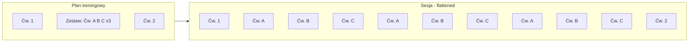

# Plan: Zestawy (scope) w planach treningowych

## Kontekst

- **Obecnie:** Ćwiczenia w planie to płaska lista; kolejność to `section_type` + `section_order`. W sesji każda pozycja to jedno ćwiczenie.
- **Docelowo:** Można dodawać "zestaw" – kilka ćwiczeń w bloku z jednym `section_order`, powtarzany N razy (np. 3× zestaw: A → B → C).

**Pojedyncze ćwiczenia:** Tak jak dziś – przycisk "Dodaj ćwiczenie" dodaje ćwiczenia **poza zestawem** (`scope_id` i `in_scope_nr` = null). W jednym planie można mieszać: np. Ćw. 1 → Zestaw (A→B→C)×3 → Ćw. 2. Nic nie znika z obecnego flow.

**Konwencja (main) vs legacy:** W projekcie są stare i nowe widoki. Wszystkie zmiany UI i nawigacja muszą być powiązane z **`src/app/(app)/(main)`** (formularze, listy, widok szczegółów planu, asystent sesji). Nie wiązać nowej funkcjonalności z `(legacy)` ani z komponentami wyłącznie z `legacy`.

## Model danych (bez rozwalania DB)

Dodanie **trzech kolumn** w `workout_plan_exercises`:

| Kolumna              | Typ               | Znaczenie                                                                                                                                    |
| -------------------- | ----------------- | -------------------------------------------------------------------------------------------------------------------------------------------- |
| `scope_id`           | UUID, nullable    | Wspólny identyfikator zestawu. Wszystkie ćwiczenia w jednym zestawie mają ten sam `scope_id`. Ćwiczenia poza zestawem: `null`.               |
| `in_scope_nr`        | integer, nullable | Kolejność w zestawie (1, 2, 3…). Poza zestawem: `null`.                                                                                      |
| `scope_repeat_count` | integer, nullable | Liczba powtórzeń zestawu (np. 3). Sensowne tylko gdy `in_scope_nr` nie jest null; można trzymać na każdym wierszu zestawu (ta sama wartość). |

- **Unikalność:** Obecny constraint `UNIQUE(plan_id, section_type, section_order)` nie pozwala na wiele wierszy z tym samym `section_order`. Trzeba go zastąpić przez `UNIQUE(plan_id, section_type, section_order, in_scope_nr)` – w PostgreSQL wiele `NULL` w `in_scope_nr` (sprawdzić dokumentację); jeśli wiele NULL jest uznawane za duplikat, użyć partial unique index: dla `in_scope_nr IS NULL` unikalne (plan_id, section_type, section_order), dla `in_scope_nr IS NOT NULL` unikalne (plan_id, section_type, section_order, scope_id, in_scope_nr). W praktyce: **drop** starego `UNIQUE(plan_id, section_type, section_order)` i dodać nowy – w jednym "slocie" (section_order) może być albo jeden wiersz z `in_scope_nr = NULL`, albo wiele wierszy z `in_scope_nr = 1, 2, 3...` (zestaw).

---

## Przepływ danych

W sesji **nie** dodajemy kolumn scope – lista ćwiczeń sesji pozostaje płaska; zestaw jest "rozwijany" przy starcie sesji (createSessionSnapshots).

---

## 1. Baza danych

- **Migracja Supabase:** W tabeli `workout_plan_exercises` dodać kolumny:
  - `scope_id` UUID NULL
  - `in_scope_nr` integer NULL (CHECK: NULL lub > 0)
  - `scope_repeat_count` integer NULL (CHECK: NULL lub >= 1)
- **Constraint:** Usunąć stary `UNIQUE(plan_id, section_type, section_order)` i dodać `UNIQUE(plan_id, section_type, section_order, in_scope_nr)` (w PostgreSQL wiele NULL w unikalności – sprawdzić dokumentację; jeśli wiele NULL jest uznawane za duplikat, użyć np. partial unique index).
- **Typy:** Zaktualizować `src/db/database.types.ts` (albo wygenerować z Supabase).

---

## 2. Typy i API (backend)

- **src/types.ts** (WorkoutPlanExerciseInput, WorkoutPlanExerciseDTO): dodać pola `scope_id?: string | null`, `in_scope_nr?: number | null`, `scope_repeat_count?: number | null`.
- **src/types/workout-plan-form.ts:** W `WorkoutPlanExerciseItemState` dodać te same pola; w `dtoToFormState` i `exerciseDtoToItemState` mapować je z DTO.
- **Walidacja** (src/lib/validation/workout-plans.ts, src/lib/validation/workout-plan-form.ts): schemat ćwiczenia rozszerzyć o opcjonalne `scope_id`, `in_scope_nr`, `scope_repeat_count`; reguły: jeśli `in_scope_nr` podane, to `scope_id` wymagane i `scope_repeat_count` opcjonalne (np. domyślnie 1); w ramach tego samego `scope_id` unikalne `in_scope_nr`.
- **Normalizacja section_order:** W src/lib/validation/workout-plan-form.ts funkcja `normalizeSectionOrders` musi działać na "slotach": slot = jedno ćwiczenie (in_scope_nr == null) albo cały zestaw (wszystkie wiersze z tym samym scope_id). Sortowanie: section_type → section_order → in_scope_nr (null przed 1,2,3). Przypisywanie section_order: każdy slot dostaje kolejny numer; w obrębie zestawu wszystkie wiersze mają ten sam section_order.
- **Walidacja duplikatów:** Obecna `validateSectionOrderDuplicates` w workout-plan-form traktuje duplikat (section_type, section_order) jako błąd. Należy ją zmienić: dopuścić wiele ćwiczeń z tym samym (section_type, section_order) tylko gdy należą do zestawu (scope_id + in_scope_nr); w jednym slocie może być albo jedno ćwiczenie bez scope, albo zestaw (wszystkie z tym samym scope_id).
- **Repozytorium / serwis planów:** Przy zapisie (create/update) przekazywać i zapisywać nowe kolumny; przy odczycie zwracać je w DTO. Listowanie ćwiczeń planu: sortowanie `section_type`, `section_order`, `in_scope_nr`.

---

## 3. Formularz planu (frontend)

- **Przycisk "Add scope":** Obok "Add exercise" w src/components/workout-plans/form/workout-plan-form.tsx dodać przycisk otwierający dialog dodawania scope.
- **AddScopeDialog (nowy komponent):** Analogiczny do AddExerciseDialog – wybór kilku ćwiczeń z biblioteki, wybór sekcji (Warm-up / Main / Cool-down) i **liczba powtórzeń scope** (np. pole liczbowe, domyślnie 3). Na potwierdzenie: wygenerować jeden `scope_id` (crypto.randomUUID()), dla każdego wybranego ćwiczenia dodać wiersz z tym samym `scope_id`, `in_scope_nr` = 1, 2, 3…, `section_order` = następny wolny slot w wybranej sekcji, `scope_repeat_count` = wybrana liczba.
- **Hook use-workout-plan-form:** W src/hooks/use-workout-plan-form.ts dodać `handleAddScope(exercises: ExerciseDTO[], sectionType, repeatCount)` – wstawia wiele pozycji z jednym scope_id i in_scope_nr 1..n, section_order = następny slot w sekcji.
- **Lista ćwiczeń – sloty i scope:** W WorkoutPlanExercisesList grupować ćwiczenia po "slocie": (section_type, section_order), przy czym scope = wszystkie z tym samym scope_id. Render:
  - **Slot bez scope:** jeden wiersz jak dziś (WorkoutPlanExerciseItem).
  - **Slot-scope:** obramowany blok (np. border, padding), nagłówek typu "Scope × 3" z polem do edycji `scope_repeat_count` i przyciskiem remove scope; wewnątrz lista ćwiczeń wg `in_scope_nr` z możliwością usunięcia pojedynczego z scope lub przesunięcia w górę/dół wewnątrz scope.
- **Kolejność slotów (move up/down):** W `handleMoveExercise` traktować "jednostkę" jako cały slot: pojedyncze ćwiczenie albo cały scope. Przesunięcie w górę/dół zmienia `section_order` całego slotu (wszystkich wierszy w slocie); po ruchu wywołać normalizację section_order (np. w formularzu lub przy zapisie).
- **Usuwanie:** Usunięcie ostatniego ćwiczenia ze scope = usunięcie scope. Usunięcie ćwiczenia ze środka scope = zmniejszenie liczby pozycji i przenumerowanie `in_scope_nr`.

Klucze do stabilnego renderu: slot można identyfikować przez `scope_id ?? \`single-${exercise.id ?? index}\``; wewnątrz zestawu key np. `scope_id` + `in_scope_nr`.

---

## 4. Start sesji – rozwijanie zestawów

- W src/services/workout-sessions.ts w `createSessionSnapshots`:
  - Sortować plan: section_type → section_order → in_scope_nr (null na koniec lub na początek – spójnie z formularzem).
  - Przed zmapowaniem do jednej płaskiej listy: **rozwinąć zestawy**. Dla każdego zestawu (scope_id + scope_repeat_count): powtórzyć ciąg ćwiczeń (po in_scope_nr) `scope_repeat_count` razy; każda powtórka to kolejne pozycje w sesji.
  - Wynik: jedna tablica snapshotów z kolejnymi `exercise_order` 1, 2, 3… Bez zmian w tabeli `workout_session_exercises` – nadal tylko exercise_order, bez scope.

Efekt: asystent sesji i historia sesji działają na płaskiej liście; użytkownik w trakcie treningu widzi po prostu kolejne ćwiczenia (w tym wielokrotnie te same z zestawu).

---

## 5. Asystent sesji i historia

- **Asystent:** Brak zmian w logice nawigacji (next/previous po indeksie w tablicy ćwiczeń). Lista ćwiczeń sesji jest już "rozłożona" (np. A, B, C, A, B, C, A, B, C), więc kursor i zapis działają jak dotąd.
- **Zapis wykonania:** Nie zapisywać osobno "która runda zestawu"; każde wystąpienie ćwiczenia w sesji to osobna pozycja z własnymi seriami/reps. Do rekordów (PR) i statystyk traktujemy każde wystąpienie jak zwykłe ćwiczenie (obecna logika wystarczy).
- **Historia sesji:** Wyświetlanie listy ćwiczeń po `exercise_order` – pozostaje płaska lista. Opcjonalnie w przyszłości: grupowanie wizualne "Scope 1", "Scope 2" – bez zmiany modelu sesji, tylko warstwa prezentacji (można pominąć w pierwszej iteracji).

---

## 6. Miejsca do zmiany (skrót)

| Warstwa              | Pliki / obszary |
| -------------------- | --------------- |
| DB                   | Migracja: kolumny + nowy unique constraint |
| Typy                 | types.ts, types/workout-plan-form.ts, database.types.ts |
| Walidacja            | workout-plans.ts, workout-plan-form.ts (normalizeSectionOrders, validateSectionOrderDuplicates, schematy) |
| Repo/serwis planów   | repositories/workout-plans.ts, services/workout-plans.ts (CRUD, buildExercisesToInsert, import) |
| Formularz            | workout-plan-form.tsx (przycisk Add scope), nowy AddScopeDialog, use-workout-plan-form.ts (handleAddScope, handleMoveExercise po slotach, handleRemove), workout-plan-exercises-list.tsx (grupowanie po slotach, blok scope), workout-plan-exercise-item (obsługa in_scope_nr w scope) |
| Sesja                | services/workout-sessions.ts (createSessionSnapshots – rozwijanie scope) |
| Widok planu (detail) | Opcjonalnie: wyświetlanie scope jako blok "Scope × N" w komponentach używanych przez **(main)** – np. WorkoutPlanDetailContent, WorkoutPlansExercisesListM3 w `(main)/_components`. Nie modyfikować widoków w `(legacy)`. |

---

## 7. Kolejność wdrożenia (sugerowana)

1. Migracja DB + typy (backend i frontend).
2. Walidacja i normalizacja section_order (slot = pojedyncze lub zestaw); zapis/odczyt w repo i serwisie planów.
3. Formularz: AddScopeDialog, handleAddScope, grupowanie listy po slotach, ruch/usuwanie po slotach.
4. createSessionSnapshots – rozwijanie zestawów przy starcie sesji.
5. Opcjonalnie: widok szczegółów planu (scope jako jeden blok) i ewentualne dopracowanie historii (grupowanie wizualne). **Na końcu:** obsługa scope w imporcie planów JSON.

---

## Uwagi

- **Nazewnictwo w UI:** W (main) wszystko jest po angielsku – w UI używać "scope" (np. "Add scope", "Scope × 3"); w kodzie/DB: `scope_id`, `in_scope_nr`, `scope_repeat_count`.
- **Import planów (JSON):** Docelowo import ma obsługiwać scope (scope_id / in_scope_nr / scope_repeat_count w pliku). Wdrożyć to na końcu; w pierwszej iteracji przy imporcie ustawiać brak scope (null).
- **Edycja planów:** Istniejące plany zostają jak są; przy odczycie/edycji ćwiczenia bez scope mają `scope_id`/`in_scope_nr`/`scope_repeat_count` = null. Można im potem dodać scope (nowe zestawy) lub zostawić pojedyncze ćwiczenia.
- **Gdzie robić zmiany UI:** Komponenty formularza w `src/components/` są współdzielone; strony i nawigacja – tylko te pod **`src/app/(app)/(main)`**. Przy dodawaniu linków, routów czy odniesień do widoków planu/sesji używać wyłącznie ścieżek i komponentów z (main).
