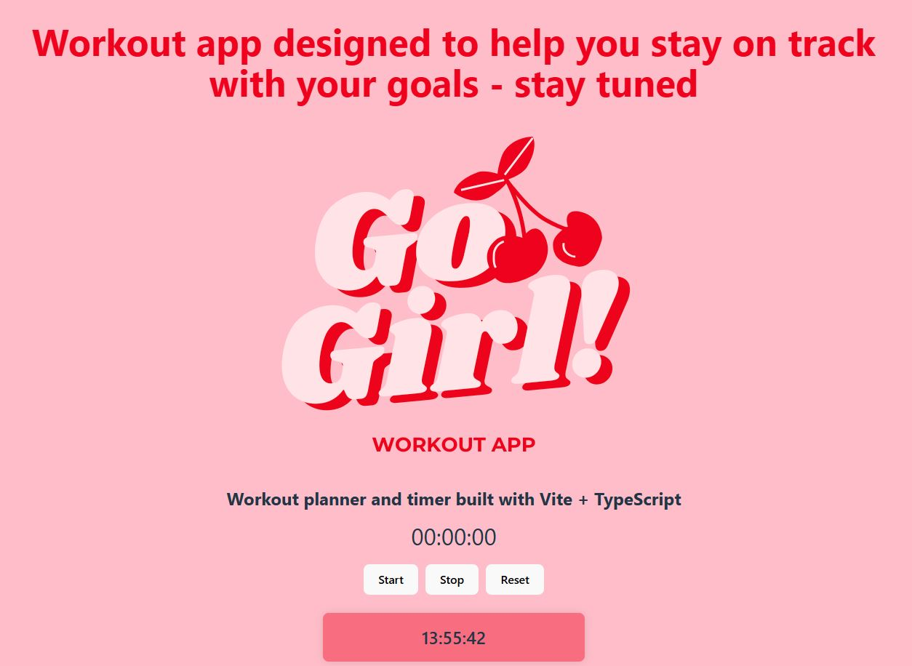

# Welcome to Go Girl Workout App! 🚀



A simple and effective tool to help you plan, track, and stay consistent with your workouts. Designed for both coaches and individual users, this app allows easy customization of workout routines, including exercise repetitions, sets, and time tracking.

## 📌 Planned features

- ✅ Customizable Workout Plans – Your coach can create a personalized training plan tailored to your sport goals.
- ✅ Adjustable Repetitions & Sets – Modify your exercises based on your progress.
- ✅ Built-in Time Counter – Stay on track with an automatic timer for exercises and breaks.
- ✅ User-Friendly Interface – Just open the app and get moving!
- ✅ Responsive Design – Use it anytime, anywhere, on desktop, tablet, or mobile.

## 📌 Roadmap

- 🔹 Phase 1: Basic workout creation & tracking
- 🔹 Phase 2: Progress tracking & analytics
- 🔹 Phase 3: Social sharing & coach feedback

# Vue Jobs Project (YouTube)

This is the project based on the [YouTube VUE.js crash course](https://www.youtube.com/watch?v=VeNfHj6MhgA).

### Install Dependencies

```bash
npm install
```

### Run Vite Frontend

Vue will run on http://localhost:3000

```bash
npm run dev
```

### Build for Production

```bash
npm run build
```

### Preview Production Build

```bash
npm run preview
```
