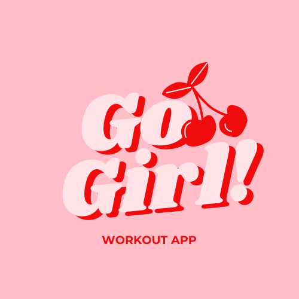

# Go Girl Workout App



Private workout planning and logging web app for women who train regularly (especially calisthenics and strength training). The goal is to make it easy to build workout plans from your own exercise library, run guided workout sessions step-by-step, and track personal records (PRs). An optional AI feature (via OpenRouter) is planned to generate/optimize plans based on user preferences.

### Table of contents

- [Features](#features)
- [tech stack](#tech-stack)
- [getting started](#getting-started)
- [available scripts](#available-scripts)
- [testing](#testing)
- [license](#license)

### Features

#### Authentication

- User registration and login
- Password reset
- Secure session management

#### Exercise library

- Create and manage your exercise collection
- Filter by body part and type
- Customize parameters (reps, time, sets, rest)

#### Workout plans

- Build reusable workout plan templates
- Organize exercises in custom order
- Set default training parameters

#### Workout sessions

- Start guided workout sessions
- Step-by-step tracking with pause/resume
- Auto-save progress
- Compare planned vs actual performance

#### Personal records

- Automatic PR tracking from workout logs
- View PR history per exercise
- Track progress over time

#### statistics

- Dedicated statistics dashboard (`/statistics`)
- Weekly metrics, streak tracking, and workout trends
- Workout calendar with completed sessions
- Statistics shortcut available on the home page

### what's next

- AI integrations for plan recommendations and smarter training assistance
- Garmin integration for syncing workouts with watch devices

### tech stack

- **Frontend**: Next.js 16, React 19, TypeScript 5
- **Styling**: Tailwind CSS 4, shadcn/ui
- **Backend**: Supabase (PostgreSQL + Auth)
- **State Management**: Zustand
- **Validation**: Zod
- **Testing**: Vitest (unit/integration tests), Playwright (E2E tests)

### getting started

#### prerequisites

- Node.js `22.19.0` (see `.nvmrc`)
- pnpm (recommended)

#### setup

1. **Install dependencies:**

   ```bash
   pnpm install
   ```

2. **Create `.env.local` file:**

   ```env
   NEXT_PUBLIC_SUPABASE_URL=your_supabase_project_url
   NEXT_PUBLIC_SUPABASE_ANON_KEY=your_supabase_anon_key
   ```

3. **Run development server:**

   ```bash
   pnpm dev
   ```

   The app will be available at `http://localhost:3000`

### available scripts

- `pnpm dev` - Start development server
- `pnpm build` - Build for production
- `pnpm start` - Run production server
- `pnpm lint` - Run ESLint
- `pnpm test` - Run unit tests with Vitest
- `pnpm test:watch` - Run unit tests in watch mode
- `pnpm test:coverage` - Run unit tests with coverage report
- `pnpm test:e2e` - Run E2E tests with Playwright
- `pnpm test:e2e:ui` - Run E2E tests with Playwright UI mode

### testing

This project uses a comprehensive testing strategy:

#### unit & integration tests (vitest)

- Fast, Vite-based test runner with native TypeScript and ESM support
- Compatible API with Jest for easy migration
- Excellent integration with React Testing Library
- Built-in coverage reporting

#### end-to-end tests (playwright)

- Reliable browser automation with auto-waiting
- Multi-browser support (Chromium, Firefox, WebKit)
- Excellent Next.js support (SSR, API routes, App Router)
- Automatic screenshots and trace viewer for debugging
- Parallel execution for fast test runs

### license

No license file is currently included in this repository. Until a license is added, **all rights are reserved** by default.
